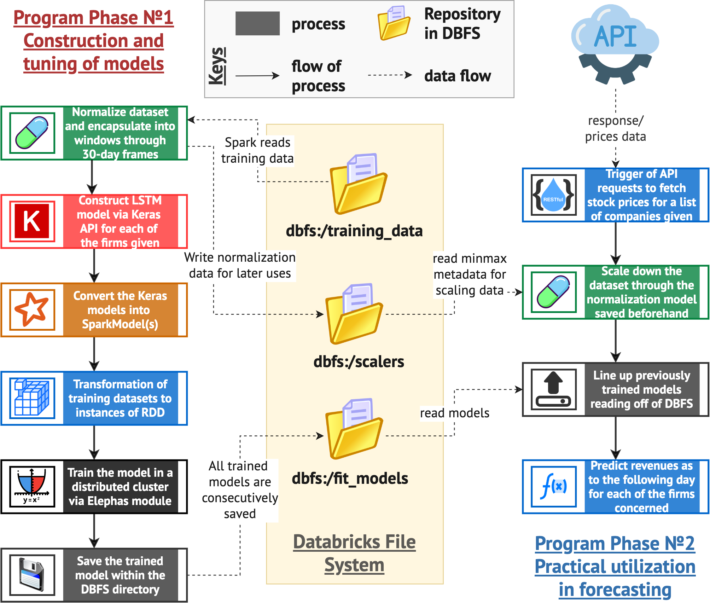
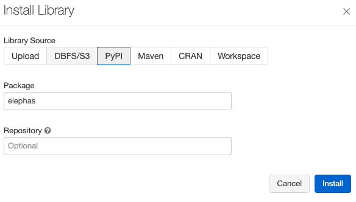
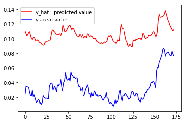
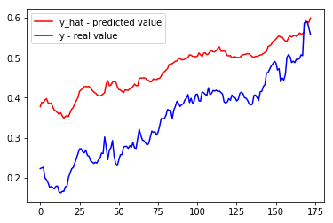
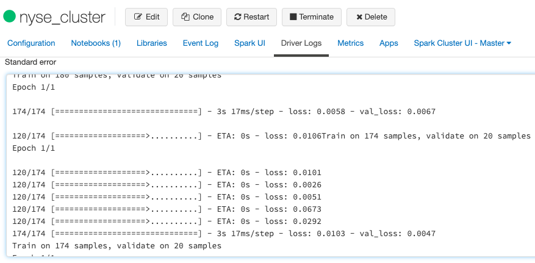
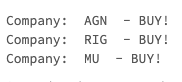

# Verdandi
**Verdandi** is a software implementation of the LSTM-based architecture for forecasting stock prices, on the following day, of the companies listed in the NYSE.

## Workflow

The program is composed of two phases: (1) the first stage that trains (numerous) models given companies provided by a user and (2) the second stage which utilizes the constructed and tuned model parameters to predict trends of the stocks and suggests which ones to buy/sell.



## Setup
1. First, create a community-edition Spark cluster on [Databricks](https://community.cloud.databricks.com/) configured by Runtime Version 6.5 (includes Apache Spark 2.4.5, Scala 2.11) supported by Python 3.
2. Install `Elephas` module in the Libraries section of the cluster:

3. Place the [training dataset](https://www.kaggle.com/dgawlik/nyse?select=prices-split-adjusted.csv) under the name of `nyse_prices.csv` in `/FileStore/tables` directory of Databricks File System.
4. Run the cells wrapping all the function definitions (do not forget to check if the scalers and fit_models directories are created with `%fs ls dbfs:/scalers` and `%fs ls dbfs:/fit_models`)
6. First invoke the first phase with the following script:

```python
# Phase 1: train models for the companies with symbols 'AGN', 'RIG' and 'MU'
main(phase_option = 'train', firm_list = ['AGN', 'RIG', 'MU'])
```

It will save the models (parameters and metadata) inside `dbfs:/fit_models` directory with the corresponding names. In addition it will produce comparison graphs between the predicted values and the real values of the test dataset.

 

If you check over the driver logs of the cluster, you'll be able to see `standard error` section that displays error values at each epoch during the training procedure.

6. Finally invoke the second phase script with different options as follows:

```python
# Phase 2: Utilization of models in actual prediction
main(phase_option='predict', firm_list=['AGN', 'RIG', 'MU'])
```


## Authors
* Erdenebileg Byambadorj (e.byambadorj@studenti.unitn.it)
* Marta Fattorel (marta.fattorel@studenti.unitn.it)

## License
This tool is available under the Creative Commons Attribution-ShareAlike License. Read more about this license from [https://creativecommons.org/licenses/by-sa/3.0/](https://creativecommons.org/licenses/by-sa/3.0/).